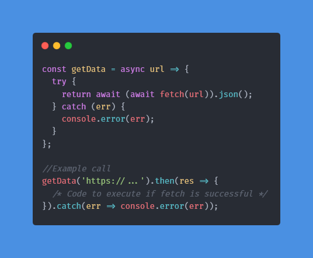

# Weather :cloud:
A desktop application that allows you to quickly check the weather at any location.

## How to use it:
The easiest way to download and run this application is to use the correct download link below. Unzip the download folder and find the file called ```weather``` (```weather.exe``` for Windows). Double click this file and the application will start. 
  
If you don't know your system architecture, read the guide for [Windows](https://www.chiefarchitect.com/support/article/KB-01230/determining-if-your-computer-is-32-bit-or-64-bit.html#Windows) or [macOS](https://www.chiefarchitect.com/support/article/KB-01230/determining-if-your-computer-is-32-bit-or-64-bit.html#macOS). On a Linux machine, type the following command in a terminal:
```
$ uname -m
```
  
### Windows (also known as win32):
- [x86 (32 bit)](https://github.com/dvptl68/Weather/raw/master/builds/weather-win32-ia32.zip)
- [x86_64 (64 bit)](https://github.com/dvptl68/Weather/raw/master/builds/weather-win32-x64.zip)
- [arm64 (64 bit)](https://github.com/dvptl68/Weather/raw/master/builds/weather-win32-arm64.zip)

### macOS/OS X (also known as darwin):
- [x64 (64 bit)](https://github.com/dvptl68/Weather/raw/master/builds/weather-darwin-x64.zip)

### Linux:
- [x86 (32 bit)](https://github.com/dvptl68/Weather/raw/master/builds/weather-linux-ia32.zip)
- [x86_64 (64 bit)](https://github.com/dvptl68/Weather/raw/master/builds/weather-linux-x64.zip)
- [armv7l (32 bit)](https://github.com/dvptl68/Weather/raw/master/builds/weather-linux-armv7l.zip)
- [arm64 (64 bit)](https://github.com/dvptl68/Weather/raw/master/builds/weather-linux-arm64.zip)

Another way to run the application is to clone the project (assuming you have node.js and npm installed). After cloning the repository, execute ```npm install``` in the root directory to install all dependencies. Then, the application will start upon executing the command ```npm start``` in the root directory.

## How it works:
*All project dependencies can be viewed in depth with the [dependency graph](https://github.com/dvptl68/weather/network/dependencies).*

This application utilizes the [Electron](https://github.com/electron/electron) framework, which allows cross-platform desktop application development with HTML, CSS, and JavaScript. Additionally, [Bootstrap 4](https://getbootstrap.com/) was used for the application layout.  
  
Weather data is accessed using the free [OpenWeatherMap API](https://openweathermap.org/api). This API allows up to 1,000,000 free requests per month to access current, 60 minute (only in the US), 48 hour, and 7 day weather data. In order to make the API request, the geographical coordinates of a location is needed. In order to allow users to select any city/address and determine the latitude and longitude, the [Algolia Places API](https://community.algolia.com/places/) was used.  
  
The [Fetch API](https://developer.mozilla.org/en-US/docs/Web/API/Fetch_API/Using_Fetch) was used to make HTTP requets. Since the fetch function returns a promise, I quickly found myself caught in [callback hell](http://callbackhell.com/). In order to remedy the mountain structure of nesting, I created the asynchronous function ```getData(url)```:



This function proved to be extremely helpful in avoiding the incredible amount of nesting.  
  
In order to avoid users having to select a location every time the application is started, I connected it to a [MongoDB database](https://www.mongodb.com/), which is hosted on [Atlas](https://www.mongodb.com/cloud/atlas). Using the [Node Machine ID package](https://www.npmjs.com/package/node-machine-id) to generate a unique ID for every user, the device name, last location selected, and its coordinates are stored as a document in the database. Every time the application is started, the database is searched for the user's unique machine ID to determine if the user has previously selected a location.

You may notice that there is also a [scripts](https://github.com/dvptl68/Weather/tree/master/scripts) folder. The scripts in this folder are not part of the actual program, but they are scripts that helped expedite the development process. Each script is described below:
- [update.sh](https://github.com/dvptl68/Weather/blob/master/scripts/update.sh) - Bash script that stages, commits, and pushes changes to the repository
- [update.cmd](https://github.com/dvptl68/Weather/blob/master/scripts/update.cmd) - CMD script that stages, commits, and pushes changes to the repository


## Contribute:
There may be bugs that I missed, so if you find a bug, you can create an issue or fork this repository, fix the bug, and create a pull request!
